# ST-BME — SillyTavern Bionic Memory Ecology

> Let the AI truly remember your story.

[中文](README.md) · **English**

ST-BME (Bionic Memory Ecology) is a **SillyTavern third-party frontend extension**. It distills the characters, events, locations, rules, plot threads, reflections, and summaries that appear over a long chat into a visual memory graph, then automatically recalls the most relevant memories and injects them into the prompt before each generation.

---

## Documentation

This README is a **slim entry point**. The details live in [`docs/`](docs/README.md):

| What you want | Where to look |
| --- | --- |
| Usage: configuration, panel, troubleshooting, storage | [`docs/usage/`](docs/usage/) |
| Architecture, control plane, data formats | [`docs/architecture/`](docs/architecture/) |
| Algorithm internals (retrieval / extraction / vectors) | [`docs/algorithms/`](docs/algorithms/) |
| How each feature works and its boundaries | [`docs/features/`](docs/features/) |
| Development, testing, contribution conventions | [`docs/contributing/`](docs/contributing/) |

Quick links: [Configuration](docs/usage/configuration.md) · [Panel guide](docs/usage/panel.md) · [Troubleshooting](docs/usage/troubleshooting.md) · [Memory model](docs/features/memory-model.md) · [History safety](docs/features/history-safety.md)

> Developer docs (architecture / algorithms / features / contributing) are currently Chinese-only. The English docs cover the README and the `docs/usage/` user manual.

---

## Core capabilities

- **Automatic memory extraction** — After each AI reply, ST-BME extracts structured nodes and relations from the conversation (characters, events, locations, rules, plot threads, reflections, subjective memories), excluding reasoning tags like `think`/`analysis`/`reasoning` by default.
- **Multi-layer hybrid recall** — Before generation, relevant memories are recalled through vector prefilter, graph diffusion, lexical boosting, multi-intent splitting, DPP diversity sampling, and optional LLM reranking; per-message persistent recall cards are supported.
- **Cognitive architecture** — Character POV / user POV / objective world memory, spatial region weighting, and a story timeline.
- **Summarization & maintenance** — Small summaries, summary rollup, reflection, consolidation, automatic compression, active forgetting — all logged and reversible.
- **Graph visualization** — A built-in canvas force-directed graph with realtime / cognitive / summary views and a mobile view.
- **Task preset system** — Extraction, recall, compression, summary, reflection, consolidation, and planning all run through a unified task profile, with regex, world info, and EJS rendering.
- **ENA Planner integration** — Pre-send story planning, integrated into the config page and the `planner` task preset.
- **Persistence & sync** — Local-first (IndexedDB), with cloud mirroring, backup/restore, rebuild, and repair.
- **History safety** — Detects message deletion / edits / swipes, automatically rolls back affected batches and recovers from the change point; protects against truncated "render only the last N" views.
- **Long-chat optimization** — Hide old turns to control tokens, limit rendered turns to reduce lag, and accelerate key computations with a Native/WASM rollout.

---

## How it works

ST-BME can be understood as three pipelines: **write** (conversation → memory), **read** (memory → injection), and **safety** (history change → recovery).

```mermaid
flowchart LR
    subgraph Write["Write: conversation → memory"]
        A["AI reply"] --> B["Structured message preprocessing"]
        B --> C["LLM extracts nodes/edges"]
        C --> D["Nearest-neighbor reconciliation + cognitive scoping"]
        D --> E["Write graph + vector sync + timeline"]
        E --> F["Consolidate / compress / summarize / reflect"]
    end

    subgraph Read["Read: memory → injection"]
        G["User about to generate"] --> H["Multi-intent + context-blended query"]
        H --> I["Vector prefilter + graph diffusion + lexical boost"]
        I --> J["Cognitive boundary filter + hybrid scoring"]
        J --> K["Optional LLM rerank + bucketed injection"]
    end

    subgraph Safe["Safety: history change → recovery"]
        L["Delete / edit / swipe"] --> M["Message hash detection"]
        M --> N["Locate affected turns"]
        N --> O["Roll back batches and vectors"]
        O --> P["Re-extract from the change point"]
    end

    F -.-> G
    P -.-> E
```



- **Write**: the conversation is normalized into structured messages (reasoning tags excluded by default) → the LLM emits structured graph operations → nodes are written, vectors synced, timeline updated → post-processing (consolidation, compression, summary, reflection, forgetting).
- **Read**: resolve the recall target → vector prefilter + graph diffusion + lexical boost → rank and filter by fusing multiple signals → bucketed injection into the prompt, optionally writing a persistent recall card.
- **Safety**: a hash is recorded for each processed message; when a history change is detected, ST-BME prefers rollback-and-replay from the maintenance log, falling back to a full rebuild only when a safe rollback is not possible.

> Algorithm details (formulas, parameters, thresholds) are in [`docs/algorithms/`](docs/algorithms/); architecture and data paths are in [`docs/architecture/overview.md`](docs/architecture/overview.md).

---

## Installation

### Option 1: install via SillyTavern extensions

Open SillyTavern → Extensions → Install third-party extension, and enter the repository URL:

```text
https://github.com/Youzini-afk/ST-Bionic-Memory-Ecology
```

Refresh the page after installation.

> Paste the repository root URL, not a GitHub sub-page URL.

### Option 2: manual installation

```bash
cd SillyTavern/data/default-user/extensions/third-party
git clone https://github.com/Youzini-afk/ST-Bionic-Memory-Ecology.git st-bme
```

Then restart or refresh SillyTavern.

---

## Quick start

1. **Open the panel** — Click "Memory Graph" in the top-left menu.
2. **Enable the plugin** — Config → Feature toggles, confirm the main switch is on.
3. **Configure the model** — Leave the memory LLM blank to reuse the current chat model; or fill in an independent OpenAI-compatible URL/key/model under "API config".
4. **Configure embedding** — Backend mode is recommended (reuses SillyTavern's configured vector provider); direct mode also works but you must handle CORS yourself.
5. **Start chatting** — Just chat normally. Extraction runs after each AI reply, and recall runs before the next generation.
6. **Check results** — "Overview" for status, "Tasks → Memory browser" for nodes, the graph area for the relation network; a recall card may appear under user messages.

> Minimum viable setup: enable the plugin and ensure the current chat model works. Recall quality drops noticeably when embedding is unavailable, so configure it early.
>
> See [Configuration](docs/usage/configuration.md) for full settings and [Panel guide](docs/usage/panel.md) for what each panel area does.

---

## Common actions

| Action | Location | Description |
| --- | --- | --- |
| Re-extract | Actions → Memory ops | Extract unprocessed turns or rerun a range |
| Manual compress | Actions → Memory ops | Merge redundant high-level nodes |
| Generate small summary | Actions → Memory ops | Produce a staged summary for the recent text window |
| Run summary rollup | Actions → Memory ops | Fold multiple active summaries into a higher-level one |
| Rebuild summary state | Actions → Memory ops | Rebuild summaryState from extraction batches |
| Force evolution | Actions → Memory ops | Let new memories actively affect old ones |
| Run forgetting | Actions → Memory ops | Archive or down-weight low-value nodes |
| Undo recent maintenance | Actions → Memory ops | Roll back the most recent reversible maintenance |
| Rebuild vectors | Actions → Vector ops | Rebuild all node embeddings |
| Range rebuild | Actions → Vector ops | Rebuild only nodes related to a turn range |
| Direct re-embed | Actions → Vector ops | Re-embed using the direct embedding config |
| Export / import / rebuild graph | Actions → Graph management | Graph management and destructive ops |
| Backup / restore cloud | Config → Cloud storage mode | Manually upload/restore in manual mode |
| Unhide all | Config → Hide old turns | Restore turns hidden by ST-BME |

> After switching embedding mode or model, run "Rebuild vectors". Per-action details and danger notes are in [Configuration](docs/usage/configuration.md) and [Panel guide](docs/usage/panel.md).

---

## Data storage & history safety (highlights)

- **Local-first**: primary storage uses IndexedDB, isolated per chat (`STBME_{chatId}`), with incremental commits on the hot path.
- **Cloud mirroring**: reuses SillyTavern's file API, supports auto/manual modes, requires no custom backend.
- **History safety**: detects delete/edit/swipe, prefers rollback-and-replay, falls back to full rebuild when needed; protects against render-truncated views to avoid wrongly clearing the graph.
- **Forward compatibility**: durable snapshots have a frozen top-level shape, tolerant parsing, and upgrade-on-read — extending the data structure means "add a field", not a big migration.

> See [Storage & sync](docs/usage/storage-and-sync.md), [History safety](docs/features/history-safety.md), and [Data formats & forward compatibility](docs/architecture/storage-and-formats.md).

---

## Having trouble?

Step-by-step troubleshooting for common situations (panel won't open, no auto-extraction, poor recall, nodes appear cleared, recall cards missing, direct embedding fails, etc.) is in [Troubleshooting](docs/usage/troubleshooting.md).

---

## Known limitations

- **Memory quality depends on the LLM** — if the extraction model misunderstands, the memory will be wrong too.
- **Embedding sets the recall floor** — without high-quality vectors, recall leans more on lexical and graph structure.
- **Direct mode may be affected by CORS** — browser security policy may block requests.
- **Very long chats still have a cost** — hiding/render limits/summary rollup reduce pressure but can't eliminate all overhead.
- **History recovery prioritizes correctness** — it falls back to a full rebuild when the log is insufficient, which can be slow.
- **Third-party themes may affect recall card mounting** — cards may skip mounting if a theme removes the standard message DOM or turn-index attributes.
- **Native acceleration is a rollout capability** — it fails open to JS by default and can be force-disabled in the panel.

---

## License

AGPLv3 — see [LICENSE](./LICENSE).
