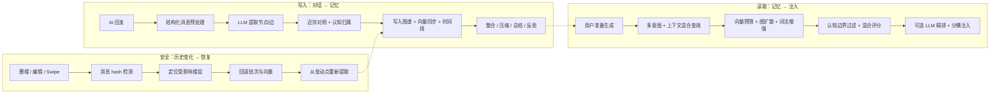

# ST-BME — SillyTavern 仿生记忆生态

> 让 AI 真正记住你们的故事。

ST-BME（Bionic Memory Ecology）是一个 **SillyTavern 第三方前端扩展**。它会把长期聊天中出现的角色、事件、地点、规则、主线、反思和总结抽取成一张可视化记忆图谱，并在下一轮生成前自动召回最相关的记忆注入 prompt。

---

## 文档导航

本 README 是**精简入口**。详细内容都在 [`docs/`](docs/README.md)：

| 你想做什么 | 去哪看 |
| --- | --- |
| 配置、面板、排障、存储等使用说明 | [`docs/usage/`](docs/usage/) |
| 理解架构、控制平面、数据格式 | [`docs/architecture/`](docs/architecture/) |
| 理解检索/提取/向量等算法原理 | [`docs/algorithms/`](docs/algorithms/) |
| 理解各功能的机制与边界 | [`docs/features/`](docs/features/) |
| 参与开发、测试、贡献约定 | [`docs/contributing/`](docs/contributing/) |

常用直达：[配置参考](docs/usage/configuration.md) · [面板导览](docs/usage/panel.md) · [排障指南](docs/usage/troubleshooting.md) · [记忆模型](docs/features/memory-model.md) · [历史安全](docs/features/history-safety.md)

---

## 核心能力

- **自动记忆提取** — AI 回复后自动从对话中提取结构化节点和关系（角色、事件、地点、规则、主线、反思、主观记忆），默认排除 `think`/`analysis`/`reasoning` 等推理标签。
- **多层混合召回** — 生成前自动召回相关记忆，链路含向量预筛、图扩散、词法增强、多意图拆分、DPP 多样性采样和可选 LLM 精排；支持消息级持久召回卡片。
- **认知架构** — 角色 POV / 用户 POV / 客观世界记忆，空间区域权重，故事时间线。
- **总结与维护** — 小总结、总结折叠、反思、整合、自动压缩、主动遗忘，带日志和回滚。
- **图谱可视化** — 内置 Canvas 力导向图谱，支持实时/认知/总结视图和移动端视图。
- **任务预设系统** — 提取、召回、压缩、总结、反思、整合、规划统一走 task profile，支持正则、世界书、EJS 渲染。
- **ENA Planner 集成** — 发送前剧情规划，整合到配置页和 `planner` 任务预设。
- **持久化与同步** — 本地优先（IndexedDB），支持云端镜像、备份/恢复、重建、修复。
- **历史安全** — 检测删楼/编辑/swipe，自动回滚受影响批次并从变动点恢复；对"只渲染最近 N 条"的截断视图有保护。
- **长聊天优化** — 隐藏旧楼层控制 token，限制渲染楼层降低卡顿，关键计算支持 Native/WASM 灰度加速。

---

## 工作原理

ST-BME 可以理解为三条链路：**写入**（对话 → 记忆）、**读取**（记忆 → 注入）、**安全**（历史变化 → 恢复）。



- **写入**：对话被规范成结构化消息（默认排除推理标签）→ LLM 提取结构化图操作 → 写入图谱、同步向量、更新时间线 → 后处理（整合、压缩、总结、反思、遗忘）。
- **读取**：解析召回目标 → 向量预筛 + 图扩散 + 词法增强 → 融合多种信号排序筛选 → 分桶注入 prompt，并可写入持久召回卡片。
- **安全**：为已处理消息记录 hash，发现历史变动时优先用维护日志回滚重放，无法安全回滚才退化为全量重建。

> 算法细节（公式、参数、阈值）见 [`docs/algorithms/`](docs/algorithms/)；架构与数据路径见 [`docs/architecture/overview.md`](docs/architecture/overview.md)。

---

## 安装

### 方法一：通过 SillyTavern 扩展安装

打开 SillyTavern → 扩展管理 → 安装第三方扩展，输入仓库地址：

```text
https://github.com/Youzini-afk/ST-Bionic-Memory-Ecology
```

安装后刷新页面。

> 请粘贴仓库根地址，不要粘贴 GitHub 的子页面地址。

### 方法二：手动安装

```bash
cd SillyTavern/data/default-user/extensions/third-party
git clone https://github.com/Youzini-afk/ST-Bionic-Memory-Ecology.git st-bme
```

然后重启或刷新 SillyTavern。

---

## 快速上手

1. **打开面板** — 左上角菜单点击"记忆图谱"。
2. **启用插件** — 配置 → 功能开关，确认主开关已启用。
3. **配置模型** — 记忆 LLM 留空时复用当前聊天模型；也可在"API 配置"填独立的 OpenAI-compatible 地址/Key/模型。
4. **配置 Embedding** — 推荐后端模式（复用 SillyTavern 已配置的向量 provider）；也可用直连模式但需自行处理 CORS。
5. **开始聊天** — 正常对话即可，AI 回复后自动提取，下次生成前自动召回。
6. **查看结果** — "总览"看状态，"任务 → 记忆浏览"看节点，图谱区域看关系网络，用户消息下方可能出现召回卡片。

> 最小可用配置：启用插件 + 保证当前聊天模型可用。Embedding 不可用时召回质量会明显下降，建议尽早配置。
>
> 完整配置说明见 [配置参考](docs/usage/configuration.md)，面板每个区域的用途见 [面板导览](docs/usage/panel.md)。

---

## 常用操作速查

| 操作 | 位置 | 说明 |
| --- | --- | --- |
| 重新提取 | 操作 → 记忆操作 | 提取未处理楼层或重跑指定范围 |
| 手动压缩 | 操作 → 记忆操作 | 合并冗余高层节点 |
| 生成小总结 | 操作 → 记忆操作 | 为近期原文窗口生成阶段性总结 |
| 执行总结折叠 | 操作 → 记忆操作 | 把多条活跃总结折叠成更高层总结 |
| 重建总结状态 | 操作 → 记忆操作 | 从提取批次重建 summaryState |
| 强制进化 | 操作 → 记忆操作 | 让新记忆主动影响旧记忆 |
| 执行遗忘 | 操作 → 记忆操作 | 归档或降权低价值节点 |
| 撤销最近维护 | 操作 → 记忆操作 | 回滚最近可撤销维护 |
| 重建向量 | 操作 → 向量操作 | 重建全部节点 embedding |
| 范围重建 | 操作 → 向量操作 | 只重建指定楼层范围相关节点 |
| 直连重嵌 | 操作 → 向量操作 | 使用直连 embedding 配置重嵌 |
| 导出 / 导入 / 重建图谱 | 操作 → 图谱管理 | 图谱管理与危险操作 |
| 备份 / 恢复云端 | 配置 → 云端存储模式 | 手动模式下主动上传/恢复 |
| 取消全部隐藏 | 配置 → 隐藏旧楼层 | 恢复 ST-BME 隐藏的楼层 |

> 切换 embedding 模式或模型后，建议执行"重建向量"。各操作的细节和危险提示见 [配置参考](docs/usage/configuration.md) 和 [面板导览](docs/usage/panel.md)。

---

## 数据存储与历史安全（要点）

- **本地优先**：主存储使用 IndexedDB，按聊天隔离（`STBME_{chatId}`），热路径用增量提交。
- **云端镜像**：复用 SillyTavern 文件 API，支持自动/手动模式，不需要自定义后端。
- **历史安全**：检测删楼/编辑/swipe，优先回滚重放、必要时全量重建；对渲染切片截断有保护，避免误清空。
- **向前兼容**：耐久快照顶层结构冻结、宽容解析、就地升级——扩展数据结构是"加字段"，不是大迁移。

> 详见 [存储与同步](docs/usage/storage-and-sync.md)、[历史安全](docs/features/history-safety.md)、[数据格式与向前兼容](docs/architecture/storage-and-formats.md)。

---

## 遇到问题？

常见情况（面板打不开、不自动提取、召回质量差、节点看似清空、召回卡片不显示、直连 Embedding 失败等）的排查步骤见 [排障指南](docs/usage/troubleshooting.md)。

---

## 已知限制

- **记忆质量依赖 LLM** — 提取模型理解错误时记忆也会错误。
- **Embedding 决定召回下限** — 没有高质量向量，召回更依赖词法和图结构。
- **直连模式可能受 CORS 影响** — 浏览器安全策略可能阻止请求。
- **超长聊天仍有成本** — 隐藏/渲染限制/总结折叠能降低压力，但不能消除所有开销。
- **历史恢复优先正确性** — 日志不足时退化为全量重建，可能较慢。
- **第三方主题可能影响召回卡片挂载** — 移除标准消息 DOM 或楼层索引属性时卡片可能跳过挂载。
- **Native 加速是灰度能力** — 默认 fail-open，失败回退 JS，可在面板强制关闭。

---

## License

AGPLv3 — 详见 [LICENSE](./LICENSE)。
